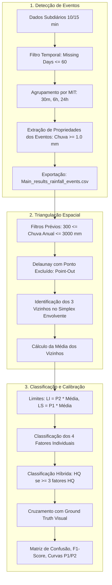

# Documentação Técnica: Pipeline Legado de Controle de Qualidade (Old Reference)

Esta documentação descreve de forma minuciosa o funcionamento da metodologia de **Controle de Qualidade Automático (A-QCP)** desenvolvida nos scripts e notebooks originais arquivados no diretório [`old reference/`](file:///d:/Projetos/QC-VORONOI/old%20reference), incluindo a fundamentação contida no relatório de Estudos Especiais da UFPB (Vidal-Barbosa & Almeida, 2025).

---

## 1. Contexto e Motivação Científica

Redes pluviométricas automáticas (como CEMADEN e Telemetria-ANA) operam com pluviômetros de báscula (*Tipping-Bucket Rain Gauges* - TBRG) sujeitos a erros instrumentais severos:
1. **Entupimento/Obstrução de funil:** gera registros estagnados ou prolongados de valores mínimos ($0.2\text{ mm}$ contínuos) ou ausência irreal de chuva enquanto estações vizinhas registram tempestades.
2. **Picos artificiais e ruídos elétricos:** pulsos espúrios superiores à precipitação física máxima esperada ($> 40\text{ mm}$ em intervalos de 10 minutos).
3. **Falhas de transmissão e baterias descarregadas:** períodos extensos de ausência de dados (*missing days*).

O objetivo do método foi substituir a inspeção visual manual (inviável para milhares de estações) por um algoritmo espacial não supervisionado calibrado contra uma base de referência confiável.

---

## 2. Fontes de Dados Originais e Dependências

Nos scripts antigos, os dados estavam dispersos em três estruturas principais:

| Componente | Origem Original | Formato | Papel no Pipeline |
|---|---|---|---|
| **Séries Subdiárias** | `1 - Organized data/{state}_{year}.h5` e `SUBDAILY_DATA_BY_YEAR/*.h5` | HDF5 (`table_data`) | Leituras brutas em intervalos de 10 min ou 15 min. |
| **Metadados de Estações** | `1 - Organized data/{state}_{year}.h5` | HDF5 (`table_info`) | Coordenadas (`lat`, `long`), altitude, cidade, rede operadora. |
| **Eventos Agregados** | `4 - Mean rainfall events/Main_results_rainfall_events_1mm_*.csv` | CSV pré-calculado | Médias e propriedades dos eventos discretizados por MIT. |
| **Ground Truth (Rótulos)** | `9 - Results/Estacoes_Alta_Qualidade_da_Analise_Visual.xlsx` | Excel (`sheet='in'`) | Classificação manual duplo-cega: Alta Qualidade (HQ) vs Baixa Qualidade (LQ). |

---

## 3. Arquitetura do Pipeline Legado (Passo a Passo)

### Etapa 1: Discretização de Eventos Pluviométricos
* **Notebook correspondente:** [`old reference/1 - Gera propriedades dos eventos chuvosos.ipynb`](file:///d:/Projetos/QC-VORONOI/old%20reference/1%20-%20Gera%20propriedades%20dos%20eventos%20chuvosos.ipynb)
* **Regra de Discretização:** A chuva contínua é fatiada em eventos discretos usando o **MIT** (*Minimum Inter-event Time*):
  - Três limiares temporais testados: **30 minutos**, **360 minutos (6 horas)** e **1439 minutos (24 horas)**.
  - Se o intervalo sem chuva entre duas leituras for $\le \text{MIT}$, o evento continua; se $> \text{MIT}$, o evento anterior é fechado e um novo é iniciado.
* **Filtro de Lâmina:** Eventos com volume acumulado $< 1.0\text{ mm}$ eram descartados.
* **Cálculo de Propriedades por Evento:**
  - Lâmina precipitada ($P$ em mm).
  - Duração ($D$ em horas).
  - Intensidade média ($I = P / D$ em mm/h).
  - Tempo seco precedente ($T_{\text{seco}}$ em horas).
* **Consolidação Anual (`set_main_results`):**
  Para cada estação, ano e MIT, eram sumarizadas as estatísticas descritivas (`sum`, `mean`, `std`, `max`), gerando a planilha anual consolidada `Main_results_rainfall_events_1mm_{ano}.csv`.

---

### Etapa 2: Triangulação de Delaunay com Exclusão (*Point-Out*)
* **Notebooks correspondentes:** 
  - [`old reference/2 - QC - CEMADEN versus CEMADEN - Triangulacao.ipynb`](file:///d:/Projetos/QC-VORONOI/old%20reference/2%20-%20QC%20-%20CEMADEN%20versus%20CEMADEN%20-%20Triangulacao.ipynb)
  - [`old reference/5.3.8 - QC - CEMADEN versus CEMADEN - Teste 7 - Delaunay point out - p1 e p2 - Fine Tuning.ipynb`](file:///d:/Projetos/QC-VORONOI/old%20reference/5.3.8%20-%20QC%20-%20CEMADEN%20versus%20CEMADEN%20-%20Teste%207%20-%20Delaunay%20point%20out%20-%20p1%20e%20p2%20-%20Fine%20Tuning.ipynb)
* **Conceito da Triangulação Delaunay *Point-Out*:**
  Ao invés de conectar o ponto-alvo aos seus vizinhos diretos (onde o ponto faz parte dos triângulos), a técnica retira temporariamente a estação-alvo da base de coordenadas. Em seguida, calcula-se a triangulação de Delaunay sobre todas as demais estações da rede.
  - Busca-se o triângulo (simplex) da malha cujo polígono circunscrito contém espacialmente as coordenadas (`lat`, `long`) da estação-alvo (`tri.find_simplex` e `Polygon.contains(ref_point)`).
  - Os 3 vértices deste triângulo envolvente constituem os **3 circunvizinhos ideais**, garantindo equidistância geométrica sem favorecer uma única direção e evitando vieses de borda.

---

### Etapa 3: Regras de Decisão e Classificação da Qualidade

O controle de qualidade antigo aplicava dois níveis sucessivos de verificação:

#### Nível 1: Verificação Físico-Climatológica Prévia
A estação era imediatamente classificada como **Baixa Qualidade (LQ)** se violasse qualquer um dos critérios:
1. Menos de 300 dias válidos com medições no ano ($\text{missing days} > 65$ dias).
2. Chuva acumulada anual fora da faixa realista do clima brasileiro: $\text{Chuva Anual} < 300\text{ mm}$ ou $> 3000\text{ mm}$.
3. Picos anômalos pontuais: registros superiores a $40\text{ mm}$ em 10 minutos.

#### Nível 2: Verificação Espacial das 4 Propriedades
Para as estações que passaram pelo Nível 1, calculava-se a média aritmética ($\mu_{\text{vizinhos}}$) das propriedades históricas dos 3 circunvizinhos de Delaunay.
Definiam-se faixas de tolerância:
$$\text{Limite Superior } (LS) = P_1 \times \mu_{\text{vizinhos}}$$
$$\text{Limite Inferior } (LI) = P_2 \times \mu_{\text{vizinhos}}$$

A estação-alvo era avaliada nas 4 propriedades:
1. `yearly_rainfall_quality`: Precipitação anual acumulada (mm).
2. `rainfall_event_quality`: Quantidade total anual de eventos.
3. `rainfall_intensity_quality`: Intensidade máxima/média de precipitação (mm/h).
4. `rainfall_duration_quality`: Duração média dos eventos (horas).

Se $LI \le \text{Propriedade}_{\text{alvo}} \le LS$, o fator era rotulado como **HQ**; caso contrário, **LQ**.

#### Nível 3: Propriedade Híbrida (`hybrid_quality`)
Para evitar penalizar estações por variações microrregionais em um único parâmetro, instituiu-se a regra de voto majoritário:
$$\text{hybrid\_quality} = \begin{cases} \text{HQ}, & \text{se } \sum (\text{fatores HQ}) \ge 3 \\ \text{LQ}, & \text{caso contrário} \end{cases}$$

---

### Etapa 4: Calibração dos Multiplicadores ($P_1, P_2$) e Resultados

* **Grid de Calibração:**
  - $P_1 \in [1.1, 2.5]$ com passo de $0.05$ / $0.10$.
  - $P_2 \in [0.5, 1.0]$ com passo de $0.05$ / $0.10$.
* **Métricas de Otimização:** Matriz de Confusão contra o conjunto de validação manual visual (Verdadeiros Positivos, Falsos Positivos, Precisão, Revocação, Acurácia e F1-Score).
* **Parâmetros Ótimos Encontrados:**
  - **$P_1 = 1.60$** (fator superior restritivo).
  - **$P_2 = 0.80$** (fator inferior restritivo).
  - **Melhor MIT:** **30 minutos**, apresentando F1-score de 0,71, acurácia de 79% e revocação de 86% na propriedade híbrida.

---

## 4. Limitações do Pipeline Antigo e Evolução para o QC-VORONOI Atual

1. **Dependência de CSVs pré-calculados:** Se houvesse atualização de estações ou novos anos, todo o pipeline manual de extração de eventos precisava ser reexecutado via caminhos absolutos locais do Windows.
2. **Caminhos fixos rígidos:** Dependia de pastas OneDrive locais de usuários específicos (`C:\Users\cnalm\...`, `C:\Users\linde\...`).
3. **Escalaridade:** Abertura e fechamento repetitivo de arquivos `.h5` e `.xlsx` geravam gargalos de memória e falta de reprodutibilidade em servidores ou Google Colab.
4. **Substituição pelo UNIPLU:** Todas essas dependências agora são unificadas e lidas diretamente dos arquivos Parquet compactados do UNIPLU (`src/data/UNIPLU/*.zip`), permitindo executar desde a ingestão bruta até o controle de qualidade e validação estatística em uma única cadeia reprodutível.
